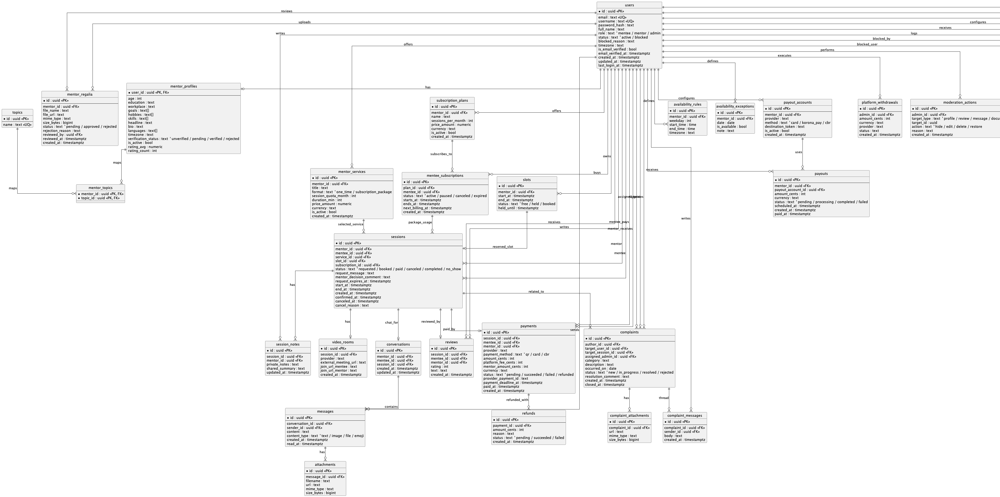

# 🎓 Mentory

> Платформа для поиска менторов и проведения онлайн-консультаций

[](https://www.typescriptlang.org/)
[](https://kit.svelte.dev/)
[](https://nestjs.com/)
[](https://pnpm.io/)
[](https://docker.com/)
[](https://github.com/tdrkn/mentory/actions/workflows/deploy-main.yml)

---

## 📋 О проекте

**Mentory** — платформа, соединяющая менти с экспертами для проведения персональных консультаций.

### Ключевые возможности (MVP)

**Для менти:**
- Структурированный профиль с бэкграундом и целями
- Поиск менторов по критериям (темы, язык, цена)
- Просмотр профилей менторов с отзывами и рейтингом
- Бронирование слотов в календаре ментора
- Видеозвонки прямо на платформе
- Чат с ментором
- Оценка и отзывы после сессии

**Для менторов:**
- Управление профилем и тарифами
- Гибкое расписание с правилами доступности
- Подтверждение/отклонение запросов
- Встроенные видеозвонки и заметки по сессиям
- Статистика (сессии, рейтинг, доход)
- Автоматические выплаты

---

## 🏗️ Архитектура

```
mentory/
├── apps/
│   ├── web/                 # SvelteKit 2 (SSR)
│   └── api/                 # NestJS 10 (REST API)
├── packages/
│   └── shared/              # Общие типы, DTO, константы
├── infra/
│   ├── docker-compose.dev.yml
│   ├── docker-compose.prod.yml
│   ├── Dockerfile.api
│   ├── Dockerfile.web
│   └── Caddyfile
├── product/
│   ├── usm.txt              # User Story Map
│   ├── er.puml              # ER-диаграмма (core product flow)
│   ├── er-admin.puml        # ER-диаграмма (admin/trust operations)
│   └── requirements-gap.md  # Gap-анализ FR/NFR/US против текущей реализации
├── .env.example
├── package.json
├── pnpm-workspace.yaml
└── tsconfig.base.json
```

### Стек технологий

| Слой | Технологии |
|------|------------|
| **Frontend** | SvelteKit 2, TypeScript |
| **Backend** | NestJS 10, TypeScript, class-validator |
| **Database** | PostgreSQL 16 |
| **Cache** | Redis 7 |
| **Reverse Proxy** | Caddy 2 (auto HTTPS) |
| **Package Manager** | pnpm 9 (workspaces) |
| **Containerization** | Docker, Docker Compose |

---

## 🚀 Быстрый старт

### Требования

- **Node.js** ≥ 22.x
- **pnpm** ≥ 9.x
- **Docker** и **Docker Compose** (для контейнеров)

### 1. Клонирование и настройка

```bash
# Клонировать репозиторий
git clone https://github.com/your-org/mentory.git
cd mentory

# Скопировать переменные окружения
cp .env.example .env

# Установить зависимости
pnpm install

# Собрать shared-пакет
pnpm --filter @mentory/shared build
```

### 2. Запуск в Docker (рекомендуется)

```bash
# Development (hot-reload)
pnpm docker:dev

# Остановить
pnpm docker:down
```

### Быстрый запуск одной командой

```bash
./scripts/start.sh
```

Остановить:

```bash
./scripts/stop.sh
```

**Сервисы:**
- Web: http://localhost:3000
- API: http://localhost:4000
- Admin: http://localhost:4000/admin
- Swagger: http://localhost:4000/api/docs
- PostgreSQL: localhost:5432
- Redis: localhost:6379

---

## ⚙️ CI/CD (автодеплой в main)

Добавлен workflow: `.github/workflows/deploy-main.yml`

Что происходит:
- при `push` в `main` запускается CI (install, lint, check, build);
- если CI зеленый, GitHub Actions подключается по SSH к серверу;
- на сервере выполняется `scripts/deploy_prod.sh`:
  - `git pull` из `main`;
  - сборка образов `api/web`, запуск `db/redis`;
  - применение Prisma-схемы в one-off контейнере (`migrate deploy` или fallback `db push`);
  - запуск `api/web/caddy`.

Если на проде видите `Prisma P2022` (например нет `users.username`), выполните:

```bash
cd /opt/mentory
bash scripts/deploy_prod.sh main
```

### GitHub Secrets (Repository → Settings → Secrets and variables → Actions)

- `DEPLOY_HOST` — IP/домен сервера
- `DEPLOY_PORT` — SSH порт (обычно `22`)
- `DEPLOY_USER` — SSH пользователь
- `DEPLOY_PATH` — путь до папки проекта на сервере (где лежит этот репозиторий)
- `DEPLOY_SSH_PRIVATE_KEY` — приватный SSH ключ для доступа к серверу

### Что нужно сделать на сервере один раз

```bash
# 1) Клонировать репозиторий в директорию из DEPLOY_PATH
git clone <your-repo-url> /opt/mentory
cd /opt/mentory

# 2) Создать и заполнить продовый .env
cp .env.example .env

# 3) Проверить ручной деплой
bash scripts/deploy_prod.sh main
```

### 3. Локальный запуск (без Docker)

```bash
# Запустить PostgreSQL и Redis локально или через Docker
docker compose -f infra/docker-compose.dev.yml up db redis -d

# Запустить все приложения
pnpm dev

# Или по отдельности
pnpm dev:web   # SvelteKit на :3000
pnpm dev:api   # NestJS на :4000
```

---

## 📜 Команды

| Команда | Описание |
|---------|----------|
| `pnpm install` | Установка зависимостей |
| `pnpm dev` | Запуск web + api в dev-режиме |
| `pnpm dev:web` | Запуск только web |
| `pnpm dev:api` | Запуск только api |
| `pnpm build` | Сборка всех пакетов |
| `pnpm lint` | Проверка линтером |
| `pnpm format` | Форматирование кода (Prettier) |
| `pnpm format:check` | Проверка форматирования |
| `pnpm docker:dev` | Запуск в Docker (dev) |
| `pnpm docker:prod` | Запуск в Docker (prod) |
| `pnpm docker:down` | Остановка Docker |
| `pnpm clean` | Очистка node_modules и артефактов |

---

## 🔧 Конфигурация

### Переменные окружения (.env)

```bash
# Application
NODE_ENV=development

# Database
DATABASE_URL=postgresql://mentory:mentory@db:5432/mentory

# API
API_PORT=4000
JWT_SECRET=change-me-in-production-min-32-chars
JWT_EXPIRES_IN=7d

# Web
PUBLIC_API_URL=http://localhost:4000
PUBLIC_APP_URL=http://localhost:3000

# Redis
REDIS_URL=redis://redis:6379

# Admin
ADMIN_EMAIL=admin@mentory.local
ADMIN_PASSWORD=change-me-admin
ADMIN_COOKIE_SECRET=change-me-cookie-secret-min-32-chars
```

Полный список переменных — в [.env.example](.env.example).

### Админ-панель

Админка доступна по адресу `http://localhost:4000/admin`. Логин/пароль берутся из `.env` (`ADMIN_EMAIL`, `ADMIN_PASSWORD`).

---

## 📁 Структура пакетов

### apps/web (SvelteKit)

```
apps/web/
├── src/
│   ├── routes/              # Страницы
│   ├── lib/                 # API client, stores, components
│   ├── app.css              # Глобальные стили
│   └── app.html             # HTML шаблон
├── svelte.config.js
├── vite.config.ts
├── tsconfig.json
└── package.json
```

### apps/api (NestJS)

```
apps/api/
├── src/
│   ├── main.ts              # Entry point
│   ├── app.module.ts        # Root module
│   └── health/
│       └── health.controller.ts
├── nest-cli.json
├── tsconfig.json
└── package.json
```

### packages/shared

```
packages/shared/
├── src/
│   ├── index.ts             # Barrel export
│   ├── types/
│   │   ├── user.ts
│   │   ├── mentor.ts
│   │   └── session.ts
│   ├── dto/
│   │   └── auth.dto.ts
│   └── constants.ts
├── tsconfig.json
└── package.json
```

---

## 🗄️ База данных

ER-диаграммы:
- core: [product/er.puml](product/er.puml)
- admin/trust: [product/er-admin.puml](product/er-admin.puml)



### Основные сущности

| Сущность | Описание |
|----------|----------|
| `users` | Пользователи (менти/ментор/оба/админ) |
| `mentor_profiles` | Профили менторов |
| `mentee_profiles` | Профили менти |
| `mentor_services` | Услуги и тарифы менторов |
| `topics` | Темы консультаций |
| `availability_rules` | Правила доступности (расписание) |
| `slots` | Временные слоты для записи |
| `sessions` | Сессии консультаций |
| `payments` | Платежи |
| `payouts` | Выплаты менторам |
| `conversations` / `messages` | Чат |
| `video_rooms` | Видеокомнаты |
| `reviews` | Отзывы и оценки |

Дополнительно: [product/requirements-gap.md](product/requirements-gap.md) — свод расхождений между целевыми требованиями и текущей реализацией.

---

## 🐳 Docker

### Development

```bash
docker compose -f infra/docker-compose.dev.yml up --build
```

Включает hot-reload через volume mounts.

### Production

```bash
docker compose -f infra/docker-compose.prod.yml up --build -d
```

- Multi-stage builds для оптимизации
- Caddy как reverse proxy с auto HTTPS
- Health checks для всех сервисов

---

## 📐 Стандарты кода

### TypeScript

- Strict mode включён
- Общая конфигурация в `tsconfig.base.json`
- Каждый пакет расширяет базовую конфигурацию

### Линтинг и форматирование

- **ESLint** — для apps/web и apps/api
- **Prettier** — единый стиль (см. `.prettierrc`)

```bash
# Проверить
pnpm lint
pnpm format:check

# Исправить
pnpm format
```

### Именование

- **Файлы**: kebab-case (`user-profile.ts`)
- **Компоненты**: PascalCase (`UserProfile.tsx`)
- **Функции/переменные**: camelCase
- **Константы**: UPPER_SNAKE_CASE
- **Типы/интерфейсы**: PascalCase с префиксом I (опционально)

---

## 🛣️ Roadmap

### MVP (v0.1)
- [x] Настройка monorepo
- [ ] Аутентификация (JWT)
- [ ] Профили менторов и менти
- [ ] Поиск менторов
- [ ] Календарь и бронирование
- [ ] Сессии и видеозвонки
- [ ] Чат
- [ ] Отзывы

### Next (v0.2+)
- [ ] Избранные менторы
- [ ] Напоминания о сессиях
- [ ] Разные способы оплаты
- [ ] Отмена/перенос сессий
- [ ] AI-заметки по сессиям

---

## 🤝 Контрибьютинг

1. Fork репозитория
2. Создать feature-ветку (`git checkout -b feature/amazing-feature`)
3. Commit изменений (`git commit -m 'Add amazing feature'`)
4. Push в ветку (`git push origin feature/amazing-feature`)
5. Открыть Pull Request

---

## 📄 Лицензия

MIT © Mentory Team

---

## 📞 Контакты

- **Email**: team@mentory.io
- **Telegram**: @mentory_support
