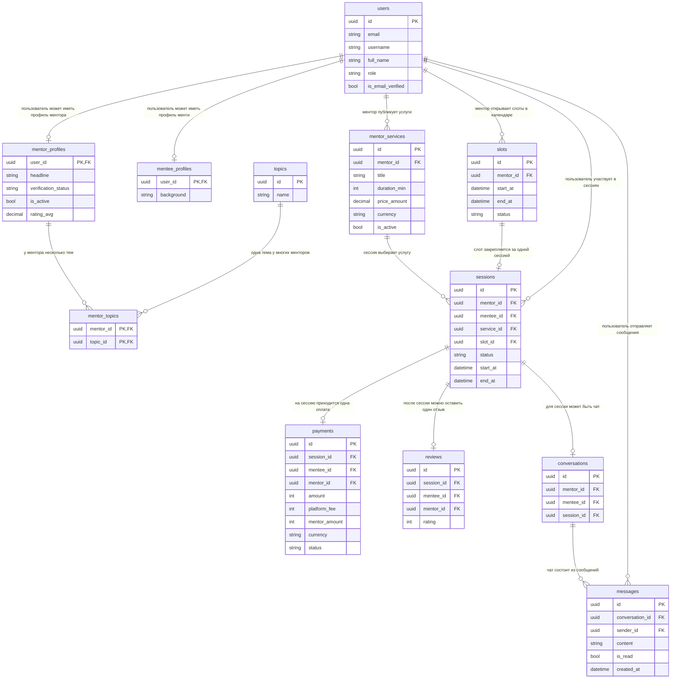

# ER-диаграмма Mentory для бизнеса (V1)

Дата: 2026-03-09

Цель этой версии: зафиксировать основной путь продукта простым языком.

## Как читать

- `PK` — основной идентификатор записи.
- `FK` — ссылка на связанную запись.
- Названия сущностей и полей оставлены на английском, подписи связей на русском.

## ER (ядро бизнеса)

## Бизнес-смысл (кратко)

- Платформа связывает `mentee` и `mentor` через `sessions`.
- До сессии есть этап выбора: темы (`topics`) -> услуги (`mentor_services`) -> свободный слот (`slots`).
- Финансовая фиксация проходит через `payments`.
- Качество услуги фиксируется через `reviews`.
- Коммуникация по работе идёт через `conversations` и `messages`.

## Что намеренно не включено в V1

- Контур `trust` (жалобы, модерация, блокировки).
- Подписки и кредиты (`mentorship_*`, `mentee_credit_*`).
- Операционные сущности второго уровня (уведомления, выплаты ментору, вывод комиссии).

## Вопросы для согласования перед V2

1. В следующую версию ER добавляем только `trust` или сразу `trust + subscriptions`?
2. В бизнес-материалах показываем одну большую ER или три отдельные (Core, Trust, Subscriptions)?
3. Для C4 считать `subscriptions` частью MVP-контейнера или отдельным bounded context?
