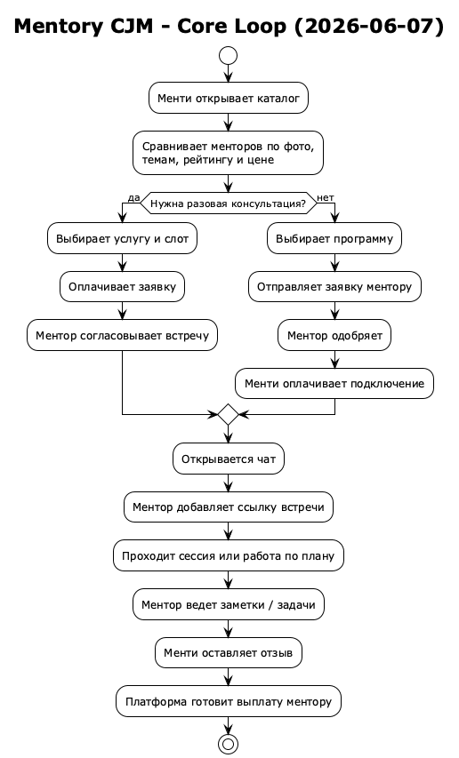
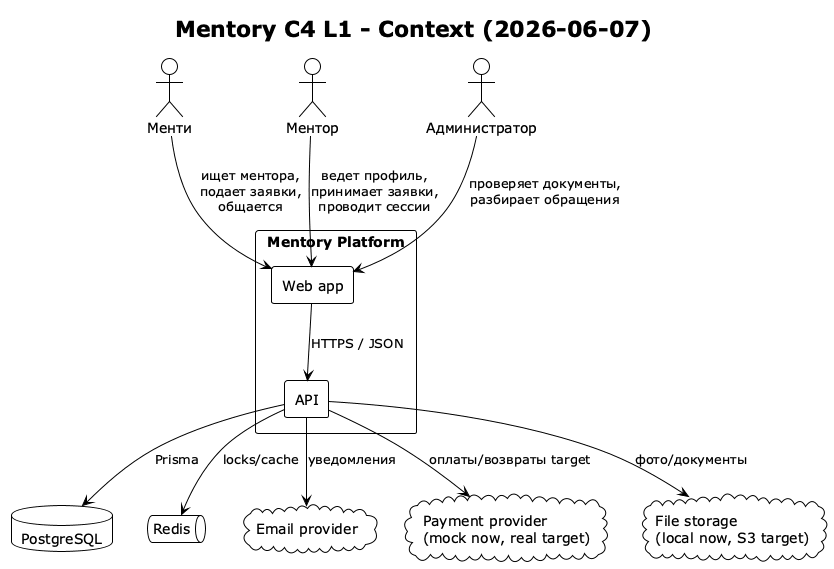
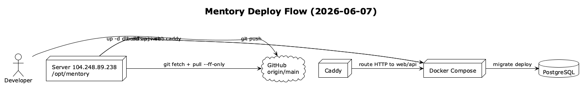

# Mentory: вводный документ для нового лидера проекта

Дата: 2026-06-07

## 1. Что такое Mentory

Mentory - платформа, где менти находит ментора, выбирает разовую консультацию или программу, отправляет заявку, оплачивает работу и дальше ведет прогресс через сессии, чат, задачи и материалы.

Простая аналогия: Mentory похож на учебный центр с ресепшеном, расписанием, переговорными, бухгалтерией и службой поддержки. Только все это собрано в веб-приложении.

## 2. Главные роли

| Роль | Что делает |
|---|---|
| Менти | Ищет ментора, отправляет заявки, оплачивает, ходит на встречи, выполняет задачи |
| Ментор | Заполняет профиль, создает услуги и программы, принимает заявки, проводит встречи |
| Администратор | Проверяет документы, разбирает обращения, смотрит выплаты и аудит |

## 3. Как устроен пользовательский путь



## 4. Архитектура простыми словами

Сейчас это **модульный монолит**. Это значит, что backend один, но внутри разделен на понятные модули: профили, поиск, бронирование, сессии, платежи, чат, помощь, подписки.

Аналогия: это один большой офис, где разные отделы сидят в разных кабинетах. Это проще обслуживать на стадии MVP, чем строить отдельное здание под каждый отдел.

Почему не микросервисы сейчас:

- проект еще быстро меняется;
- команда маленькая;
- один backend проще деплоить и отлаживать;
- микросервисы добавили бы сетевые ошибки, очереди, трассировку и DevOps-сложность раньше времени.

## 5. C4 Context



## 6. Основные части системы

| Часть | Технология | Зачем |
|---|---|---|
| Web | SvelteKit | Рисует сайт и админку |
| API | NestJS | Бизнес-логика и HTTP endpoints |
| Shared | TypeScript package | Общие типы между web и API |
| Database | PostgreSQL + Prisma | Хранит пользователей, сессии, платежи |
| Redis | Redis | Locks, future queues, realtime support |
| Files | Local uploads now, MinIO/S3 target | Фото, документы, вложения |
| Proxy | Caddy | Отдает сайт по IP/домену |
| Docker | Docker Compose | Запуск локально и на сервере |

## 7. Важные домены

### Профили

Ментор хранит фото, карьеру, навыки, хобби, документы, услуги и программы. Это витрина доверия.

### Каталог

Каталог показывает много менторов с фото, темами, рейтингом и ценой от N рублей. Демо-данные лежат в `apps/api/prisma/seed.ts`.

### Сессии

Разовая консультация проходит состояния: заявка, оплата, согласование, встреча, завершение, отзыв.

### Подписки

Подписка в коде - это подключение к программе. Человеку в интерфейсе говорим "подключение", потому что слово "подписка" часто звучит как автоматическое списание без контекста.

### Чат

Чат связывает ментора и менти. Enter отправляет сообщение, Shift+Enter делает перенос строки.

### Помощь и безопасность

Здесь пользователь отправляет обращение, а ментор загружает документы. Внутри API часть маршрутов все еще называется `trust`, чтобы не ломать контракты.

## 8. Данные и seed

Seed - это сценарий наполнения базы демо-данными.

В нем сейчас:

- 16 менторов, включая демо-профиль Растяпина Данила;
- 3 менти;
- 1 администратор;
- темы, услуги, программы, документы, слоты;
- демо-сессии разных статусов;
- чаты, отзывы, бонусный баланс.

Команда локально:

```bash
docker exec -w /app/apps/api mentory-api pnpm seed
```

Важно: seed пересоздает демо-данные. На production с реальными пользователями его нельзя запускать без осознанного решения.

## 9. Как запустить локально

```bash
pnpm install
docker compose up -d
pnpm --filter @mentory/api build
pnpm --filter @mentory/web check
```

Обычно сайт доступен на:

- web: `http://localhost:3000`
- api: `http://localhost:4000/api`
- health: `http://localhost:4000/api/health/ready`

## 10. Как деплоится



## 11. Что проверять после деплоя

Мини-smoke:

1. Открыть каталог менторов.
2. Убедиться, что менторов много и есть фото.
3. Зайти тестовым пользователем.
4. Открыть `/sessions`, `/chat`, `/subscriptions`, `/trust`.
5. Проверить health endpoint.

## 12. Тестовые аккаунты

| Роль | Логин | Пароль |
|---|---|---|
| Админ | `admin@mentory.local` | `change-me-admin` |
| Ментор | `danil.rastyapin@example.com` | `password123` |
| Ментор | `maria.mentor@example.com` | `password123` |
| Ментор | `alex.mentor@example.com` | `password123` |
| Менти | `ivan.mentee@example.com` | `password123` |
| Менти | `anna.mentee@example.com` | `password123` |

## 13. Что уже недавно исправлено

- Расширены demo-data, добавлен видимый профиль Растяпина Данила.
- Фото появились в каталоге и верхнем меню.
- Сессии показывают важные заявки первыми.
- Сохранение ссылки встречи и заметок показывает результат.
- Чат отправляет по Enter.
- Тяжелые термины заменены на простые.
- Темная тема стала читаемой.
- Подписки стали рабочим пространством программ.

## 14. Что еще не хватает до идеального продукта

High priority:

- реальные платежи, возвраты и выплаты;
- cancel/reschedule;
- admin queues вместо технических UUID-форм;
- production storage;
- monitoring, backups, load tests.

Medium priority:

- notification center;
- saved filters;
- profile completeness score;
- mobile visual polish;
- отдельные detail screens заявок.

## 15. Где читать дальше

- `product/README.md` - карта папки product.
- `product/reports/mini-report-2026-06-07.md` - краткая стадия продукта.
- `product/reports/framework-map-2026-06-07.md` - раскладка по фреймворкам.
- `product/gaps/figma-product-gap-2026-06-07.md` - различия с Figma/product.
- `apps/api/prisma/schema.prisma` - настоящая модель данных.
- `apps/api/prisma/seed.ts` - демо-сценарий.
