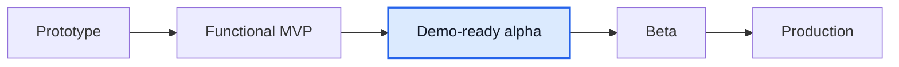

# Мини-отчет Mentory

Дата: 2026-06-07

## TL;DR

Mentory сейчас на стадии **demo-ready alpha / functional MVP+**. Core loop уже можно показывать: каталог менторов, профиль, заявка на сессию, подтверждение ментором, чат, подписочные программы, рабочий план, помощь и безопасность, админ-контур.

После последнего difference-pass закрыты важные UX-разрывы:

- demo seed расширен до 16 менторов с фото, услугами, программами, документами и слотами; отдельный видимый демо-профиль добавлен для Растяпина Данила;
- фото отображаются в каталоге и верхнем меню;
- сессии сразу показывают важные заявки, а CTA говорит понятным действием;
- чат отправляет по Enter, Shift+Enter переносит строку;
- "Траст", "кредиты", "регалии" заменены на понятные русские названия;
- темная тема стала читаемее;
- `/subscriptions` переработан в рабочее пространство менторских программ;
- `/sessions/:id` получил отмену встречи с причиной, освобождением слота и refund/fail маркировкой платежа.

Оценка готовности: **73-77% от идеального продукта**. Это уже сильный demo-product, но еще не beta: не хватает production providers, reschedule flow, финальной модерации без UUID, monitoring/NFR evidence и полного pixel-perfect прохода по Figma.

## Степень различий с материалами

| Источник            |                           Текущая разница | Что изменилось                                                                                                  |
| ------------------- | ----------------------------------------: | --------------------------------------------------------------------------------------------------------------- |
| DOCX-отчет          | Высокая на архитектуре, средняя на домене | Код остается modular monolith, а отчет описывает микросервисы. Это осознанно: для MVP монолит проще и надежнее. |
| Figma basics PDF    |                                   Средняя | Основные экраны есть, но не все detail screens 1:1: заявки, финансы, модерация, подписки.                       |
| PNG профилей        |                            Низкая-средняя | Профиль ментора на просмотр и редактирование уже приведены к структуре макетов.                                 |
| Последний UX-фидбек |                            Низкая-средняя | Закрыты demo-data, фото, сессии/чат, термины, темная тема, подписки.                                            |

## Что уже работает как продукт

- **Поиск ментора:** каталог с реальными карточками, фото, темами, ценой в рублях.
- **Профиль ментора:** о себе, карьера, навыки, хобби, документы, отзывы, услуги и программы.
- **Сессии:** заявки, подтверждение/отклонение, ссылка встречи, заметки, завершение.
- **Подписки:** программа, заявка, approve-first, оплата, рабочий план с задачами и материалами.
- **Чат:** REST + Socket.IO, вложения, ссылки, Enter behavior.
- **Помощь и безопасность:** обращения, документы ментора, админ-проверка.
- **Админка:** dashboard, проверки, обращения, блокировки, выплаты, аудит.

## Главные риски

1. **Платежи и выплаты пока mock/manual.** Для production нужны real acquiring, refunds, payout provider.
2. **Файлы пока local storage.** MinIO есть в окружении, но production adapter и lifecycle policy надо довести.
3. **NFR не доказаны.** 99.9%, 50k users, RTO/RPO и retention пока target-only.
4. **Часть UI все еще техническая.** Админские UUID-формы и ручные коды программ нужно заменить очередями и объектными карточками.
5. **Нет полноценного reschedule.** Отмена встречи есть на MVP-уровне, но перенос в новый слот с подтверждением второй стороны еще не реализован.

## Стадия продукта

Мы находимся в **Demo-ready alpha**: продукт можно показывать, но перед beta нужен sprint на реальные провайдеры, UX очередей, перенос встреч и NFR evidence.

## Что делать дальше

1. **Beta UX sprint:** заявки detail screens, reschedule, финансы, moderation queues.
2. **Provider sprint:** acquiring/refunds, payout provider, storage adapter.
3. **Reliability sprint:** logs, metrics, backups, load tests, runbooks.
4. **Figma polish sprint:** плотность, mobile states, empty/error/loading states, текст без технических терминов.

## Ссылки на артефакты

- `product/reports/framework-map-2026-06-07.md`
- `product/gaps/figma-product-gap-2026-06-07.md`
- `product/handbook/mentory-leadership-intro.md`
- `product/handbook/mentory-leadership-intro.pdf`
- `product/diagrams/2026-06-07-c4-l1-context.puml`
- `product/diagrams/2026-06-07-c4-l2-containers.puml`
- `product/diagrams/2026-06-07-cjm-core-loop.puml`
- `product/diagrams/2026-06-07-deploy-flow.puml`
- `product/diagrams/2026-06-07-product-stage.puml`
