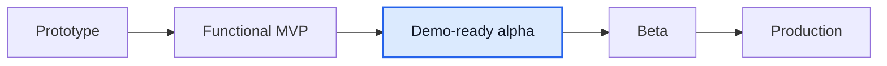

# Мини-отчет Mentory

Дата: 2026-06-08

## TL;DR

Mentory остается на стадии **demo-ready alpha / functional MVP+**, но стал ближе к Figma/product по финансовому контуру пользователей.

Оценка готовности: **76-79% от идеального продукта**. Прирост небольшой, но важный для CJM: раздел `Финансы` теперь не только менторский, менти видит историю оплат и одобренные подписки к оплате, а платежная история больше не ломается на subscription payments без `session`.

## Что изменилось

- `/earnings` стал role-aware разделом `Финансы`.
- Ментор по-прежнему видит KPI, историю платежей и блок вывода средств.
- Менти видит оплаченную сумму, активные программы, возвраты, историю оплат и CTA оплаты одобренных подписок.
- Header показывает wallet-ссылку `Финансы` для mentor/mentee; admin остается в `/admin/trust#database`.
- UI корректно отображает платежи одиночных сессий и подписок, а суммы из API cents форматирует как рубли.

## Сверка с источниками

| Источник                                       | Вывод                                                                                                                                        |
| ---------------------------------------------- | -------------------------------------------------------------------------------------------------------------------------------------------- |
| `product/gaps/figma-product-gap-2026-06-07.md` | Finance больше не high UI-gap; остались providers, saved payout methods и reconciliation.                                                    |
| `product/gaps/frontend-gap.md`                 | Добавлен закрытый MVP-gap по mentee finance и subscription payment history.                                                                  |
| Google Drive `Отчет.docx`                      | Старый отчет подтверждает сценарии финансов ментора и оплаты услуг; локальные product docs актуальнее.                                       |
| Figma-derived материалы                        | В Figma у менти есть пункт `Финансы`; содержание не уточнено, поэтому MVP-решение ограничено историей оплат и pending subscription checkout. |

## Что еще не доделано

1. **Reschedule:** перенос оплаченной встречи в новый слот с подтверждением второй стороны.
2. **Request detail screens:** отдельные 1:1 страницы заявки на сессию и подписку.
3. **Admin queues:** объектные очереди профилей, отзывов, сообщений и поддержки без ручных UUID.
4. **Real providers:** acquiring/refunds/payout provider, reconciliation и сохраненные payout methods.
5. **NFR evidence:** load tests, backups, RTO/RPO, monitoring, retention/export.

## Stage

До beta главным продуктовым блоком остается не базовая работоспособность, а доведение high-touch flows: заявки, перенос, админские очереди и реальные платежные провайдеры.
