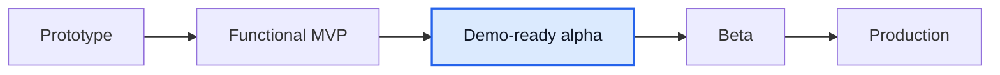

# Мини-отчет Mentory

Дата: 2026-06-09

## TL;DR

Mentory остается на стадии **demo-ready alpha / functional MVP+**, но стал ближе к Figma/product в контуре заявок: у разовых сессий и подписок появились отдельные страницы деталей заявки.

Оценка готовности: **78-81% от идеального продукта**. Прирост связан не с новым доменом, а с закрытием заметного CJM-разрыва: из списка `/requests` теперь можно открыть конкретную заявку, увидеть контактные данные, цель, мотивацию, summary card и выполнить доступное действие.

## Что изменилось

- Добавлен API `GET /api/subscriptions/:subscriptionId` с проверкой доступа участника и include `plan`, `mentor`, `mentee`.
- Добавлена страница `/requests/sessions/:id` для заявки на разовую сессию.
- Добавлена страница `/requests/subscriptions/:id` для заявки на подписку.
- Список `/requests` теперь ведет на detail pages, а не на общую встречу или общий раздел подписок.
- Detail pages поддерживают mentor decision actions, mentee payment CTA для ожидающей оплаты подписки и переход к operational session/subscription screens.

## Сверка с источниками

| Источник                                       | Вывод                                                                                                                                          |
| ---------------------------------------------- | ---------------------------------------------------------------------------------------------------------------------------------------------- |
| `product/gaps/figma-product-gap-2026-06-07.md` | High-gap `Requests detail screens` закрыт на MVP-уровне; осталось polish карточек списка, profile/chat shortcuts и pixel-perfect плотность.    |
| `product/gaps/frontend-gap.md`                 | Добавлен QA evidence для desktop/mobile detail pages; горизонтальный overflow = 0, console/page errors = 0.                                    |
| Google Drive recent files                      | В последних 20 Drive-файлах за 2026-06-08/09 не найден свежий явный Mentory/`Отчет.docx` документ; локальные product docs остаются актуальнее. |
| Figma-derived материалы                        | Экран `Заявка на сессию` и экран `Управление заявками` подтверждают отдельный detail-layout с contact info, мотивацией и правой summary card.  |

## QA evidence

- `product/qa-screenshots/qa-2026-06-09-request-session-detail-desktop.png`
- `product/qa-screenshots/qa-2026-06-09-request-session-detail-mobile.png`
- `product/qa-screenshots/qa-2026-06-09-request-subscription-detail-desktop.png`
- `product/qa-screenshots/qa-2026-06-09-request-subscription-detail-mobile.png`

Проверено через Playwright against Docker dev stack:

- `/requests/sessions/:id`: HTTP 200, заголовок виден, console/page errors = 0, horizontal overflow = 0.
- `/requests/subscriptions/:id`: HTTP 200, заголовок виден, console/page errors = 0, horizontal overflow = 0.

## Что еще не доделано

1. **Reschedule:** перенос оплаченной встречи в новый слот с подтверждением второй стороны.
2. **Admin queues:** объектные очереди профилей, отзывов, сообщений и поддержки без ручных UUID.
3. **Booking request polish:** `/booking/new` все еще не pixel-perfect Figma pay-first форма.
4. **Real providers:** acquiring/refunds/payout provider, reconciliation и сохраненные payout methods.
5. **NFR evidence:** load tests, backups, RTO/RPO, monitoring, retention/export.

## Stage

До beta главный фокус смещается с заявок detail screens на перенос встреч, админские очереди, реальные провайдеры и операционную доказанность продукта.
