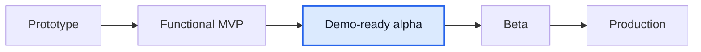

# Мини-отчет Mentory

Дата: 2026-06-13

## TL;DR

Mentory остается на стадии **demo-ready alpha / functional MVP+**, но стал ближе к Figma/product в контуре профиля mentee и завершения сессии: документация по `goals[]` синхронизирована с кодом, а отзыв вынесен на отдельный экран `/sessions/:id/review`.

Оценка готовности: **80-82% от идеального продукта**. Прирост связан с закрытием Figma-gap по review page и с исправлением backend-дефекта, который ломал отправку отзыва в PostgreSQL dev stack.

## Что изменилось

- Product/API docs по mentee profile обновлены под фактическое состояние: `PATCH /profile/mentee` принимает `goals[]`, `/mentees/:id` показывает цели, карьеру, навыки и хобби.
- Добавлена страница `/sessions/:id/review` с карточкой прошедшей сессии, 5 интерактивными звездами, textarea и lock-state для недоступного/уже отправленного отзыва.
- Inline-форма отзыва удалена из `/sessions/:id`; detail page теперь ведет на отдельный review route или показывает `Отзыв уже отправлен`.
- `GET /api/sessions` включает `review.id`, чтобы список `/sessions` показывал `Оценить ментора` или `Отзыв отправлен`.
- `createReview` переведен с raw SQL на Prisma transaction: review создается, затем `ratingAvg/ratingCount` пересчитываются без Postgres cast-ошибки `uuid = text`.

## Сверка с источниками

| Источник                                       | Вывод                                                                                                                                                 |
| ---------------------------------------------- | ----------------------------------------------------------------------------------------------------------------------------------------------------- |
| Google Drive recent files                      | В последних 20 Drive-файлах после прошлого запуска не найден свежий явный Mentory/`Отчет.docx`; локальные product docs остаются актуальнее.          |
| `product/gaps/figma-alignment-plan.md`         | Итерация 8 `Оценить ментора` переведена в `закрыто MVP 2026-06-13`; следующим крупным gap остается reschedule.                                        |
| `product/gaps/requirements-gap.md`             | FR11/US9 теперь описывают отдельный review screen, окно +24h и уникальность по session + mentee/mentor pair.                                          |
| `product/gaps/frontend-gap.md`                 | Добавлен QA-сценарий review page и runtime defect: raw SQL пересчета рейтинга заменен Prisma transaction.                                             |
| Figma-derived материалы                        | Экран `Оценить ментора` требует отдельный page-level UI; текущий `/sessions/:id/review` закрывает это на MVP-уровне.                                  |

## QA evidence

Проверено against Docker dev stack:

- `pnpm --filter @mentory/web check`: 0 errors, 0 warnings.
- `pnpm --filter @mentory/api build`: успешно.
- `pnpm --filter @mentory/api test`: 4 suites passed, 39 tests passed.
- Browser QA: completed session открывает `/sessions/:id/review`, mobile viewport 390x844 имеет horizontal overflow = 0, submit редиректит на `/sessions?tab=past&review=1`, success banner виден, список показывает `Отзыв отправлен`.

## Что еще не доделано

1. **Reschedule:** перенос оплаченной встречи в новый слот с подтверждением второй стороны.
2. **Admin queues:** объектные очереди профилей, отзывов, сообщений и поддержки без ручных UUID.
3. **Booking request polish:** `/booking/new` все еще не pixel-perfect Figma pay-first форма.
4. **Real providers:** acquiring/refunds/payout provider, reconciliation и saved payout methods.
5. **NFR evidence:** load tests, backups, RTO/RPO, monitoring, retention/export.

## Stage

До beta главный фокус: reschedule, admin queues, реальные провайдеры и операционная доказанность продукта.
