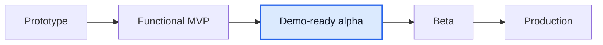

# Мини-отчет Mentory

Дата: 2026-06-14

## TL;DR

Mentory остается на стадии **demo-ready alpha / functional MVP+** и стал ближе к product/Figma по двум направлениям: найден свежий Drive-артефакт `Ментори_Документация_Сайт_12_06.pdf`, а in-app уведомления теперь видны пользователю через header notification center.

Оценка готовности: **82-84% от идеального продукта**. Прирост связан не с новым core-domain, а с закрытием видимого notification gap и синхронизацией product-папки с фактическим состоянием регистрации/календаря.

## Что изменилось

- Добавлен bell dropdown в `AppHeader`: unread badge, последние уведомления, переход к session/chat/finance/request target, mark read/read-all.
- Backend notification copy локализован: session/message/payment/payout уведомления создаются на русском, суммы форматируются в RUB.
- `markAsRead` и `markAllAsRead` теперь заполняют `readAt`, а не только `isRead`.
- Product docs синхронизированы с кодом: регистрация уже использует `firstName`/`lastName`, login UI email-only, `/schedule` и `/schedule/calendar` закрыты MVP-уровнем.
- Google Drive `Ментори_Документация_Сайт_12_06.pdf` зафиксирован как внешний sanity check: он подтверждает front/back/DB/chat/subscriptions/payments и friends-and-family testing, но старше review/notification pass.

## Сверка с источниками

| Источник                               | Вывод                                                                                                                           |
| -------------------------------------- | ------------------------------------------------------------------------------------------------------------------------------- |
| Google Drive recent/search             | Последние recent-файлы не показывали Mentory, но search по `Mentory` нашел `Ментори_Документация_Сайт_12_06.pdf` от 2026-06-11. |
| Figma MCP                              | Доступ активен, но в репозитории нет node-specific figma.com URL; валидируемся по локальным Figma-derived PDF/PNG notes.        |
| `product/gaps/figma-alignment-plan.md` | Iteration 1, 15 и 16 синхронизированы как закрытые MVP по текущему коду.                                                        |
| `product/gaps/frontend-gap.md`         | Notifications переведены из полного gap в MVP-закрытие; push/settings остаются backlog.                                         |
| `product/gaps/requirements-gap.md`     | NFR16 уточнен: in-app/email есть, push/settings/production queue нет.                                                           |

## QA evidence

- `pnpm --filter @mentory/web check`: 0 errors, 0 warnings.
- `pnpm --filter @mentory/api build`: успешно.
- `pnpm --filter @mentory/api test`: 4 suites passed, 39 tests passed.
- Browser QA на `http://localhost:3000`: desktop header notification dropdown открывается, empty state виден, horizontal overflow = 0.
- Browser QA mobile 390x844: mobile menu notification panel открывается, console errors = 0, horizontal overflow = 0.

## Что еще не доделано

1. **Reschedule:** перенос оплаченной встречи в новый слот с подтверждением второй стороны.
2. **Admin queues:** объектные очереди профилей, отзывов, сообщений и поддержки без ручных UUID.
3. **Booking/subscription polish:** pixel-perfect `/booking/new`, `/subscriptions/new` и карточки `/requests`.
4. **Real providers:** acquiring/refunds/payout provider, reconciliation и saved payout methods.
5. **NFR evidence:** load tests, backups, RTO/RPO, monitoring, retention/export.
6. **Notifications post-MVP:** persisted settings, push delivery и production queue.

## Stage

До beta главный фокус не изменился: reschedule, admin queues, реальные провайдеры и операционная доказанность продукта.
